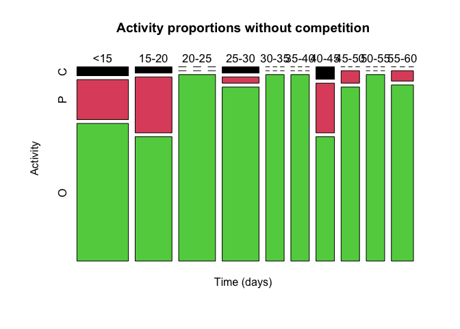
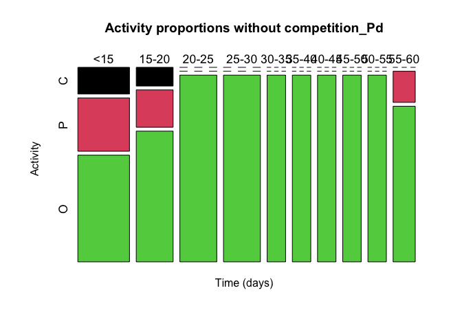
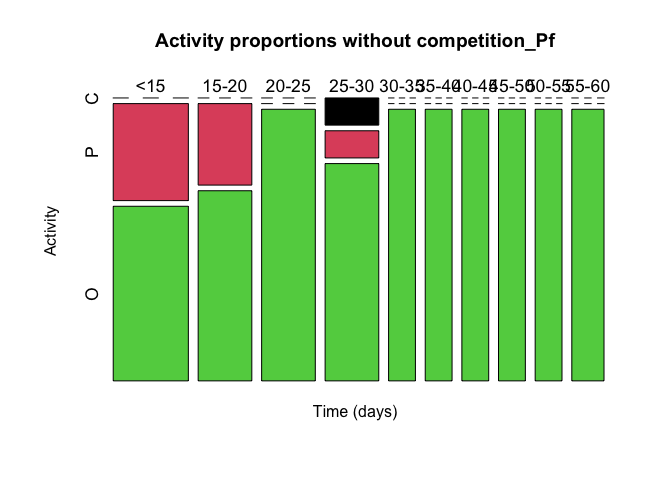
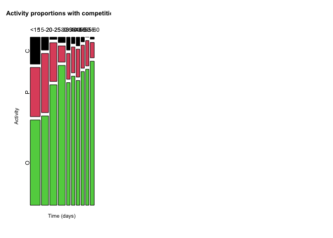
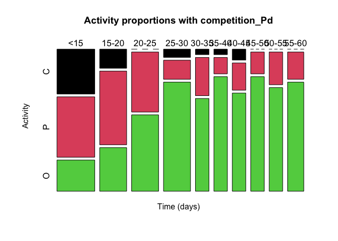
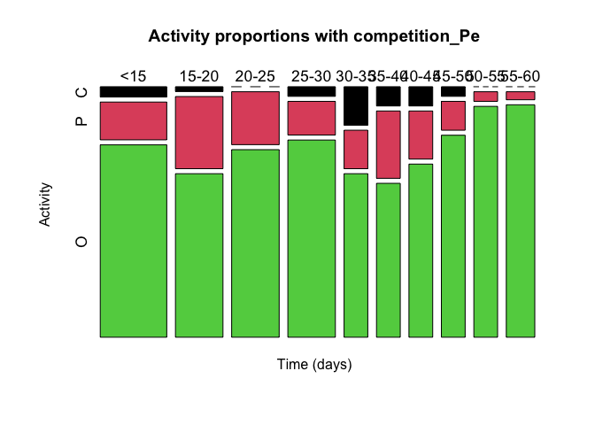
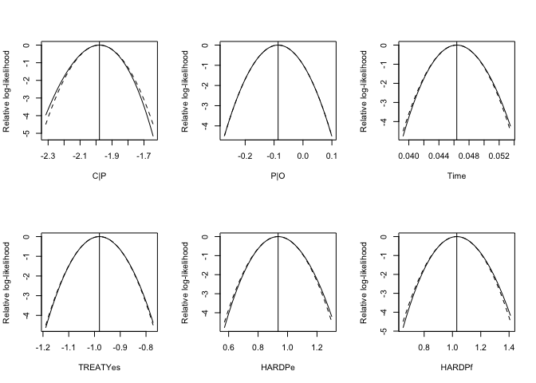
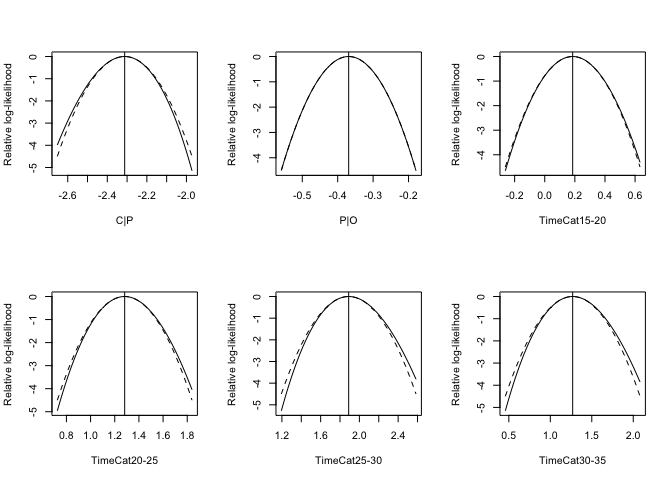

Polyp Activity. Data Exploration and Statistical Analysis
================
Rhondda Jones, Natalia Andrade and Ira Cooke
29/08/2017

``` r
Polyp_Act<-read.csv("raw_data/Porites_polypact.csv")
Polyp_Act_long<-melt(Polyp_Act, id = c('TANK','TIMEPOINT','Treatment', 'SOFT','HARD','COLONY','SP','TREAT'))
polyp = Polyp_Act_long
polyp<- polyp %>% rename(Activity=value)
table(polyp$Activity)                       
```

    ## 
    ##   C   O   P 
    ##  75 998 261

``` r
polyp$TANK = factor(polyp$TANK)
Time<-as.integer(str_match(polyp$variable, pattern = "DAY([0-9]+)")[,2])
polyp<- cbind(polyp,Time)
## make polyp activity an ordered factor
polyp$Activity = factor(polyp$Activity, levels = c("C", "P","O"), ordered=TRUE)
## create time categories to generate descriptive plots
#polyp$TimeCat = cut(polyp$Time, breaks=c(0,9.9,19.9,34.9,60))
#polyp$TimeCat = cut(polyp$Time, breaks=c(0,10.1,13.1,16.1,19.1,22.1,25.1,28.1,31.1,34.1,37.1,40.1,43.1,46.1,49.1,52.1,55.1,58.1,60))
polyp$TimeCat = cut(polyp$Time, breaks=c(0,14.1,19.1,24.1,29.1,34.1,39.1,44.1,49.1,54.1,60)) 
polyp$TimeCat = factor(polyp$TimeCat, labels=c("<15","15-20","20-25","25-30","30-35","35-40","40-45","45-50","50-55","55-60"))
```

``` r
## table and plot for no competition
polyp<- polyp %>% group_by(HARD)
polyp_Pd<- polyp %>% group_by(HARD) %>% filter(HARD=="Pd")
polyp_Pe<- polyp %>% group_by(HARD) %>% filter(HARD=="Pe")
polyp_Pf<- polyp %>% group_by(HARD) %>% filter(HARD=="Pf")

timeTableN = with(polyp[polyp$TREAT=="NO",],table(TimeCat, Activity))
#pdf(file="results/MosaicPlot_Control_Allsamples.pdf",height =8,width = 10)
mosaicplot(timeTableN, col=1:3,cex.axis = 1.05, font=14,
           main="Activity proportions without competition", xlab="Time (days)")
```

<!-- -->

``` r
#dev.off()
```

``` r
timeTableN_Pd = with(polyp_Pd[polyp_Pd$TREAT=="NO",],table(TimeCat, Activity))
#pdf(file="results/MosaicPlot_Control_Pd.pdf",height =8,width = 12)
mosaicplot(timeTableN_Pd, col=1:3,cex.axis = 1.1, 
           main="Activity proportions without competition_Pd", xlab="Time (days)")
```

<!-- -->

``` r
#dev.off()
```

``` r
timeTableN_Pe = with(polyp_Pe[polyp_Pe$TREAT=="NO",],table(TimeCat, Activity))
#pdf(file="results/MosaicPlot_Control_Pe.pdf",height =8,width = 12)
mosaicplot(timeTableN_Pe, col=1:3,cex.axis = 1.1, 
           main="Activity proportions without competition_Pe", xlab="Time (days)")
```

<!-- -->

``` r
#dev.off()
```

``` r
timeTableN_Pf = with(polyp_Pf[polyp_Pf$TREAT=="NO",],table(TimeCat, Activity))
#pdf(file="results/MosaicPlot_Control_Pf.pdf",height =8,width = 12)
mosaicplot(timeTableN_Pf, col=1:3,cex.axis = 1.1, 
           main="Activity proportions without competition_Pf", xlab="Time (days)")
```

<!-- -->

``` r
#dev.off()
```

``` r
## table and plot for competition
par(mfrow=c(1,3))

timeTableY = with(polyp[polyp$TREAT=="Yes",],table(TimeCat, Activity))
#pdf(file="results/MosaicPlot_Treat_Allsamples.pdf",height =8,width = 10)
mosaicplot(timeTableY, col=1:3,cex.axis = 1.1, 
           main="Activity proportions with competition", xlab="Time (days)")
#dev.off()
```

<!-- -->

``` r
timeTableY_Pd = with(polyp_Pd[polyp_Pd$TREAT=="Yes",],table(TimeCat, Activity))
#pdf(file="results/MosaicPlot_Treat_Pd.pdf",height =8,width = 12)
mosaicplot(timeTableY_Pd, col=1:3, cex.axis = 1.1, 
           main="Activity proportions with competition_Pd", xlab="Time (days)")
```

<!-- -->

``` r
#dev.off()
```

``` r
timeTableY_Pe = with(polyp_Pe[polyp_Pe$TREAT=="Yes",],table(TimeCat, Activity))
#pdf(file="results/MosaicPlot_Treat_Pe.pdf",height =8,width = 12)
mosaicplot(timeTableY_Pe, col=1:3, cex.axis = 1.1, 
           main="Activity proportions with competition_Pe", xlab="Time (days)")
```

<!-- -->

``` r
#dev.off()
```

``` r
timeTableY_Pf = with(polyp_Pf[polyp_Pf$TREAT=="Yes",],table(TimeCat, Activity))
#pdf(file="results/MosaicPlot_Treat_Pf.pdf",height =8,width = 12)
mosaicplot(timeTableY_Pf, col=1:3, cex.axis = 1.1, 
           main="Activity proportions with competition_Pf", xlab="Time (days)")
```

<!-- -->

``` r
#dev.off()
```

``` r
# check data balance
table(polyp$Activity,polyp$TANK)
```

    ##    
    ##      2  3 17 18 20 21 44 45 53 54 65 66 68 69 71 72 74 75 83 84 86 87 89 90 98
    ##   C  0  5  0  4  1  1  0  1  4  0  0  4  1  0  1  2  0  4  4  3  0  1  3  2  2
    ##   P  3 10  4 15  4 11  1  3  2  4  3 13  5  4  3  3  6  5 14 16  2  7  8  5 10
    ##   O 19 38 18 34 17 41 21 49 16 49 19 36 16 49 18 32 16 44  4 34 20 45 11 46 10
    ##    
    ##     99 104 105 107 108 116 117 119 120 122 123
    ##   C  4   0   2   0   3  10   1   4   4   1   3
    ##   P 13   4  13   2   5   8  26   9   9   7   4
    ##   O 36  18  38  20  45   4  26   9  40  14  46

``` r
table(polyp$TREAT,polyp$TANK)
```

    ##      
    ##        2  3 17 18 20 21 44 45 53 54 65 66 68 69 71 72 74 75 83 84 86 87 89 90
    ##   NO   0  0  0  0  0  0  0  0  0  0  0  0 53 53  0  0  0  0  0  0 53 53  0  0
    ##   Yes 53 53 53 53 53 53 53 53 53 53 53 53  0  0 53 53 53 53 53 53  0  0 53 53
    ##      
    ##       98 99 104 105 107 108 116 117 119 120 122 123
    ##   NO   0  0   0   0  53  53   0   0   0   0   0   0
    ##   Yes 53 53  53  53   0   0  53  53  53  53  53  53

``` r
## random effect Tank
## potential explanatory variables: Time, TREAT, HARD

## initially try models without random effects
fm00 = clm(Activity ~ Time+TREAT+HARD, Hess=TRUE, data=polyp)
summary(fm00)
```

    ## formula: Activity ~ Time + TREAT + HARD
    ## data:    polyp
    ## 
    ##  link  threshold nobs logLik  AIC     niter max.grad cond.H 
    ##  logit flexible  1334 -848.87 1709.74 5(0)  7.31e-08 2.8e+04
    ## 
    ## Coefficients:
    ##           Estimate Std. Error z value Pr(>|z|)    
    ## Time      0.046370   0.005145   9.013  < 2e-16 ***
    ## TREATYes -0.980807   0.214440  -4.574 4.79e-06 ***
    ## HARDPe    0.935900   0.158259   5.914 3.34e-09 ***
    ## HARDPf    1.030500   0.162260   6.351 2.14e-10 ***
    ## ---
    ## Signif. codes:  0 '***' 0.001 '**' 0.01 '*' 0.05 '.' 0.1 ' ' 1
    ## 
    ## Threshold coefficients:
    ##     Estimate Std. Error z value
    ## C|P -1.97878    0.26279  -7.530
    ## P|O -0.08607    0.24853  -0.346
    ## (574 observations deleted due to missingness)

``` r
slice.fm00 = ordinal::slice(fm00, lambda = 5)
par(mfrow=c(2,3))
plot(ordinal::slice(fm00))     ## well-behaved for both thresholds & explanatory variables
```

<!-- -->

``` r
## curvature?
fm01 = clm(Activity ~ Time+I((Time/10)^2) + TREAT +HARD, Hess=TRUE, data=polyp)
summary(fm01)
```

    ## formula: Activity ~ Time + I((Time/10)^2) + TREAT + HARD
    ## data:    polyp
    ## 
    ##  link  threshold nobs logLik  AIC     niter max.grad cond.H 
    ##  logit flexible  1334 -838.95 1691.91 5(0)  8.07e-08 5.7e+04
    ## 
    ## Coefficients:
    ##                Estimate Std. Error z value Pr(>|z|)    
    ## Time            0.14004    0.02162   6.478 9.28e-11 ***
    ## I((Time/10)^2) -0.15097    0.03334  -4.528 5.97e-06 ***
    ## TREATYes       -1.00682    0.21656  -4.649 3.33e-06 ***
    ## HARDPe          0.95516    0.15977   5.978 2.26e-09 ***
    ## HARDPf          1.04454    0.16364   6.383 1.73e-10 ***
    ## ---
    ## Signif. codes:  0 '***' 0.001 '**' 0.01 '*' 0.05 '.' 0.1 ' ' 1
    ## 
    ## Threshold coefficients:
    ##     Estimate Std. Error z value
    ## C|P  -0.9130     0.3528  -2.588
    ## P|O   1.0179     0.3498   2.910
    ## (574 observations deleted due to missingness)

``` r
anova(fm00, fm01)
```

    ## Likelihood ratio tests of cumulative link models:
    ##  
    ##      formula:                                        link: threshold:
    ## fm00 Activity ~ Time + TREAT + HARD                  logit flexible  
    ## fm01 Activity ~ Time + I((Time/10)^2) + TREAT + HARD logit flexible  
    ## 
    ##      no.par    AIC  logLik LR.stat df Pr(>Chisq)    
    ## fm00      6 1709.7 -848.87                          
    ## fm01      7 1691.9 -838.95  19.828  1  8.473e-06 ***
    ## ---
    ## Signif. codes:  0 '***' 0.001 '**' 0.01 '*' 0.05 '.' 0.1 ' ' 1

``` r
confint(fm01)
```

    ##                      2.5 %      97.5 %
    ## Time            0.09769475  0.18249664
    ## I((Time/10)^2) -0.21607346 -0.08522629
    ## TREATYes       -1.44808196 -0.59669059
    ## HARDPe          0.64459987  1.27140748
    ## HARDPf          0.72698356  1.36899351

``` r
## clear curvature (changes flatten off as day increases)
```

``` r
## well-behaved
##  better to use time categories rather than continuous time?
fm02 = clm(Activity ~ TimeCat+TREAT+HARD, Hess=TRUE, data=polyp)
summary(fm02)
```

    ## formula: Activity ~ TimeCat + TREAT + HARD
    ## data:    polyp
    ## 
    ##  link  threshold nobs logLik  AIC     niter max.grad cond.H 
    ##  logit flexible  1334 -827.70 1683.40 5(0)  1.50e-08 1.2e+02
    ## 
    ## Coefficients:
    ##              Estimate Std. Error z value Pr(>|z|)    
    ## TimeCat15-20   0.1855     0.1958   0.947  0.34347    
    ## TimeCat20-25   1.2822     0.2265   5.660 1.51e-08 ***
    ## TimeCat25-30   1.8893     0.2661   7.100 1.25e-12 ***
    ## TimeCat30-35   1.2697     0.3000   4.232 2.32e-05 ***
    ## TimeCat35-40   1.5207     0.3171   4.796 1.62e-06 ***
    ## TimeCat40-45   1.0026     0.2827   3.547  0.00039 ***
    ## TimeCat45-50   1.6667     0.3346   4.982 6.31e-07 ***
    ## TimeCat50-55   1.8926     0.3538   5.350 8.80e-08 ***
    ## TimeCat55-60   2.2008     0.3628   6.066 1.31e-09 ***
    ## TREATYes      -1.0181     0.2175  -4.680 2.87e-06 ***
    ## HARDPe         0.9727     0.1612   6.034 1.60e-09 ***
    ## HARDPf         1.0681     0.1652   6.464 1.02e-10 ***
    ## ---
    ## Signif. codes:  0 '***' 0.001 '**' 0.01 '*' 0.05 '.' 0.1 ' ' 1
    ## 
    ## Threshold coefficients:
    ##     Estimate Std. Error z value
    ## C|P  -2.3122     0.2581  -8.958
    ## P|O  -0.3690     0.2425  -1.522
    ## (574 observations deleted due to missingness)

``` r
anova(fm01, fm02)
```

    ## Likelihood ratio tests of cumulative link models:
    ##  
    ##      formula:                                        link: threshold:
    ## fm01 Activity ~ Time + I((Time/10)^2) + TREAT + HARD logit flexible  
    ## fm02 Activity ~ TimeCat + TREAT + HARD               logit flexible  
    ## 
    ##      no.par    AIC  logLik LR.stat df Pr(>Chisq)   
    ## fm01      7 1691.9 -838.95                         
    ## fm02     14 1683.4 -827.70   22.51  7   0.002074 **
    ## ---
    ## Signif. codes:  0 '***' 0.001 '**' 0.01 '*' 0.05 '.' 0.1 ' ' 1

``` r
## categories are much better
slice.fm02 = ordinal::slice(fm02, lambda = 5)
par(mfrow=c(2,3))
plot(ordinal::slice(fm02)) ## still well behaved
```

<!-- --><!-- --><!-- -->

``` r
#   nominal instead?
#fm02.nom = clm(Activity ~ 1, nominal= ~TimeCat + TREAT+HARD, data=polyp)
#summary(fm02.nom)
#anova(fm01, fm02.nom)    ### nominal is NOT better for fixed effects
                         ### so proportional odds assumption is not violated


### INCLUDE RANDOM EFFECT OF TANK
fm1.1 = clmm2(location=Activity ~ Time+TREAT+HARD, Hess=TRUE, data=polyp)
fm1 = clmm2(location=Activity ~ Time+TREAT+HARD, random=TANK, Hess=TRUE, data=polyp)

summary(fm1)
```

    ## Cumulative Link Mixed Model fitted with the Laplace approximation
    ## 
    ## Call:
    ## clmm2(location = Activity ~ Time + TREAT + HARD, random = TANK, 
    ##     data = polyp, Hess = TRUE)
    ## 
    ## Random effects:
    ##           Var   Std.Dev
    ## TANK 0.387766 0.6227086
    ## 
    ## Location coefficients:
    ##          Estimate Std. Error z value Pr(>|z|)  
    ## Time      0.0490   0.0056     8.8073 < 2.22e-16
    ## TREATYes -0.9564   0.3588    -2.6653 0.00769172
    ## HARDPe    1.0749   0.3087     3.4815 0.00049862
    ## HARDPf    1.0447   0.3080     3.3917 0.00069449
    ## 
    ## No scale coefficients
    ## 
    ## Threshold coefficients:
    ##     Estimate Std. Error z value
    ## C|P -2.0238   0.4043    -5.0061
    ## P|O -0.0240   0.3949    -0.0607
    ## 
    ## log-likelihood: -831.6681 
    ## AIC: 1677.336 
    ## Condition number of Hessian: 28180.38 
    ## (574 observations deleted due to missingness)

``` r
AIC(fm1, fm1.1)
```

    ##       df      AIC
    ## fm1    7 1677.336
    ## fm1.1  6 1709.737

``` r
anova(fm1, fm1.1)
```

    ## Likelihood ratio tests of cumulative link models
    ## 
    ## Response: Activity
    ##                       Model Resid. df -2logLik   Test    Df LR stat.
    ## 1 Time + TREAT + HARD |  |       1328 1697.737                      
    ## 2 Time + TREAT + HARD |  |       1327 1663.336 1 vs 2     1 34.40076
    ##        Pr(Chi)
    ## 1             
    ## 2 4.485482e-09

``` r
## definitely needs to allow for tank effects!!!

## check for curvature in the time effect (add quadratic term)
fm2 =clmm2(location=Activity ~ Time+I((Time/10)^2)+TREAT+HARD, random=TANK,Hess=TRUE,  data=polyp)
summary(fm2)
```

    ## Cumulative Link Mixed Model fitted with the Laplace approximation
    ## 
    ## Call:
    ## clmm2(location = Activity ~ Time + I((Time/10)^2) + TREAT + HARD, 
    ##     random = TANK, data = polyp, Hess = TRUE)
    ## 
    ## Random effects:
    ##            Var   Std.Dev
    ## TANK 0.4194109 0.6476194
    ## 
    ## Location coefficients:
    ##                Estimate Std. Error z value Pr(>|z|)  
    ## Time            0.1511   0.0223     6.7752 1.2420e-11
    ## I((Time/10)^2) -0.1642   0.0342    -4.8060 1.5398e-06
    ## TREATYes       -0.9890   0.3696    -2.6761 0.00744736
    ## HARDPe          1.1079   0.3187     3.4765 0.00050795
    ## HARDPf          1.0635   0.3177     3.3477 0.00081492
    ## 
    ## No scale coefficients
    ## 
    ## Threshold coefficients:
    ##     Estimate Std. Error z value
    ## C|P -0.8694   0.4780    -1.8187
    ## P|O  1.1796   0.4770     2.4732
    ## 
    ## log-likelihood: -820.4712 
    ## AIC: 1656.942 
    ## Condition number of Hessian: 47787.65 
    ## (574 observations deleted due to missingness)

``` r
## HAS CURVATURE
```

``` r
## Revert to time categories as before
fm3a =clmm2(location=Activity ~ 1, random=TANK, Hess=TRUE,  data=polyp)
       ## convergence failure for random effects but marginal - 0.00002
fm3b =clmm2(location=Activity ~ TimeCat, random=TANK, Hess=TRUE,  data=polyp)
fm3c =clmm2(location=Activity ~ TimeCat+TREAT, random=TANK, Hess=TRUE,  data=polyp)
fm3d =clmm2(location=Activity ~ TimeCat+TREAT+HARD, random=TANK, Hess=TRUE,  data=polyp)

anova(fm3a, fm3b, fm3c, fm3d)
```

    ## Likelihood ratio tests of cumulative link models
    ## 
    ## Response: Activity
    ##                          Model Resid. df -2logLik   Test    Df  LR stat.
    ## 1                      1 |  |       1331 1767.750                       
    ## 2                TimeCat |  |       1322 1631.770 1 vs 2     9 135.97950
    ## 3        TimeCat + TREAT |  |       1321 1626.985 2 vs 3     1   4.78494
    ## 4 TimeCat + TREAT + HARD |  |       1319 1614.142 3 vs 4     2  12.84324
    ##       Pr(Chi)
    ## 1            
    ## 2 0.000000000
    ## 3 0.028709644
    ## 4 0.001626019

``` r
AIC(fm3a, fm3b, fm3c, fm3d)
```

    ##      df      AIC
    ## fm3a  3 1773.750
    ## fm3b 12 1655.770
    ## fm3c 13 1652.985
    ## fm3d 15 1644.142

``` r
  ## fm3c best, residual deviance OK, fit looks OK

summary(fm3d) ## Hessian OK
```

    ## Cumulative Link Mixed Model fitted with the Laplace approximation
    ## 
    ## Call:
    ## clmm2(location = Activity ~ TimeCat + TREAT + HARD, random = TANK, 
    ##     data = polyp, Hess = TRUE)
    ## 
    ## Random effects:
    ##            Var   Std.Dev
    ## TANK 0.4648678 0.6818121
    ## 
    ## Location coefficients:
    ##              Estimate Std. Error z value Pr(>|z|)  
    ## TimeCat15-20  0.2089   0.2016     1.0358 0.30030409
    ## TimeCat20-25  1.4298   0.2371     6.0315 1.6249e-09
    ## TimeCat25-30  2.0754   0.2793     7.4314 1.0746e-13
    ## TimeCat30-35  1.2912   0.3131     4.1239 3.7244e-05
    ## TimeCat35-40  1.5622   0.3290     4.7476 2.0580e-06
    ## TimeCat40-45  1.0310   0.2955     3.4884 0.00048588
    ## TimeCat45-50  1.7337   0.3464     5.0052 5.5795e-07
    ## TimeCat50-55  1.9666   0.3649     5.3886 7.0989e-08
    ## TimeCat55-60  2.2797   0.3735     6.1040 1.0342e-09
    ## TREATYes     -1.0133   0.3833    -2.6436 0.00820229
    ## HARDPe        1.1508   0.3321     3.4653 0.00052968
    ## HARDPf        1.0932   0.3309     3.3035 0.00095469
    ## 
    ## No scale coefficients
    ## 
    ## Threshold coefficients:
    ##     Estimate Std. Error z value
    ## C|P -2.3882   0.4236    -5.6383
    ## P|O -0.3083   0.4133    -0.7460
    ## 
    ## log-likelihood: -807.071 
    ## AIC: 1644.142 
    ## Condition number of Hessian: 79.12734 
    ## (574 observations deleted due to missingness)

``` r
## check back for TANK effects with the time category model
fm3f = clmm2(location=Activity ~ TimeCat+TREAT+HARD, Hess=TRUE,  data=polyp)
anova(fm3f, fm3d)
```

    ## Likelihood ratio tests of cumulative link models
    ## 
    ## Response: Activity
    ##                          Model Resid. df -2logLik   Test    Df LR stat.
    ## 1 TimeCat + TREAT + HARD |  |       1320 1655.399                      
    ## 2 TimeCat + TREAT + HARD |  |       1319 1614.142 1 vs 2     1 41.25664
    ##        Pr(Chi)
    ## 1             
    ## 2 1.334973e-10

``` r
AIC(fm3f, fm3d)
```

    ##      df      AIC
    ## fm3f 14 1683.399
    ## fm3d 15 1644.142

``` r
## TANK effect remains hugely significant!!


## check confidence intervals & behaviour of tank effect
pr3d = profile(fm3d, range=c(0.3, 2), nsteps=30, trace=0)
confint(pr3d)
```

    ##           2.5 %    97.5 %
    ## stDev 0.4746616 0.9637968

``` r
plot(pr3d)
```

<!-- -->

``` r
## not bad, sd pretty well estimated despite the warnings
```

``` r
## Find predicted probabilities for an "average" tank
predictions = cbind(polyp, pred=predict(fm3d, newdata=polyp))
with(na.omit(predictions), round(tapply(pred, list(Activity, TREAT,HARD, TimeCat), mean), 3))
```

    ## , , Pd, <15
    ## 
    ##      NO   Yes
    ## C 0.084 0.202
    ## P 0.339 0.467
    ## O 0.576 0.331
    ## 
    ## , , Pe, <15
    ## 
    ##      NO   Yes
    ## C    NA 0.074
    ## P    NA 0.316
    ## O 0.811 0.610
    ## 
    ## , , Pf, <15
    ## 
    ##      NO   Yes
    ## C    NA 0.078
    ## P 0.168 0.326
    ## O 0.802 0.596
    ## 
    ## , , Pd, 15-20
    ## 
    ##      NO   Yes
    ## C 0.069 0.170
    ## P 0.304 0.451
    ## O 0.626 0.378
    ## 
    ## , , Pe, 15-20
    ## 
    ##      NO   Yes
    ## C    NA 0.061
    ## P 0.136 0.281
    ## O 0.841 0.658
    ## 
    ## , , Pf, 15-20
    ## 
    ##      NO   Yes
    ## C    NA 0.064
    ## P 0.142 0.291
    ## O 0.833 0.645
    ## 
    ## , , Pd, 20-25
    ## 
    ##     NO   Yes
    ## C   NA    NA
    ## P   NA 0.269
    ## O 0.85 0.674
    ## 
    ## , , Pe, 20-25
    ## 
    ##      NO   Yes
    ## C    NA    NA
    ## P    NA 0.114
    ## O 0.947 0.867
    ## 
    ## , , Pf, 20-25
    ## 
    ##      NO  Yes
    ## C    NA 0.02
    ## P    NA 0.12
    ## O 0.944 0.86
    ## 
    ## , , Pd, 25-30
    ## 
    ##      NO   Yes
    ## C    NA 0.031
    ## P    NA 0.172
    ## O 0.916 0.797
    ## 
    ## , , Pe, 25-30
    ## 
    ##      NO   Yes
    ## C    NA 0.010
    ## P    NA 0.064
    ## O 0.972 0.926
    ## 
    ## , , Pf, 25-30
    ## 
    ##      NO   Yes
    ## C 0.004    NA
    ## P 0.026 0.068
    ## O 0.970 0.922
    ## 
    ## , , Pd, 30-35
    ## 
    ##      NO   Yes
    ## C    NA 0.065
    ## P    NA 0.292
    ## O 0.832 0.643
    ## 
    ## , , Pe, 30-35
    ## 
    ##     NO   Yes
    ## C   NA 0.022
    ## P   NA 0.128
    ## O 0.94 0.850
    ## 
    ## , , Pf, 30-35
    ## 
    ##      NO   Yes
    ## C    NA 0.023
    ## P    NA 0.134
    ## O 0.937 0.843
    ## 
    ## , , Pd, 35-40
    ## 
    ##      NO   Yes
    ## C    NA 0.050
    ## P    NA 0.248
    ## O 0.867 0.702
    ## 
    ## , , Pe, 35-40
    ## 
    ##      NO   Yes
    ## C    NA 0.016
    ## P    NA 0.102
    ## O 0.954 0.882
    ## 
    ## , , Pf, 35-40
    ## 
    ##      NO   Yes
    ## C    NA    NA
    ## P    NA 0.107
    ## O 0.951 0.875
    ## 
    ## , , Pd, 40-45
    ## 
    ##      NO   Yes
    ## C    NA 0.083
    ## P    NA 0.336
    ## O 0.792 0.581
    ## 
    ## , , Pe, 40-45
    ## 
    ##      NO   Yes
    ## C 0.010 0.028
    ## P 0.066 0.158
    ## O    NA 0.814
    ## 
    ## , , Pf, 40-45
    ## 
    ##      NO   Yes
    ## C    NA    NA
    ## P    NA 0.165
    ## O 0.919 0.805
    ## 
    ## , , Pd, 45-50
    ## 
    ##      NO   Yes
    ## C    NA    NA
    ## P    NA 0.221
    ## O 0.885 0.737
    ## 
    ## , , Pe, 45-50
    ## 
    ##      NO   Yes
    ## C    NA 0.014
    ## P 0.034 0.088
    ## O 0.961 0.898
    ## 
    ## , , Pf, 45-50
    ## 
    ##      NO   Yes
    ## C    NA 0.015
    ## P    NA 0.092
    ## O 0.958 0.893
    ## 
    ## , , Pd, 50-55
    ## 
    ##      NO   Yes
    ## C    NA    NA
    ## P    NA 0.187
    ## O 0.907 0.779
    ## 
    ## , , Pe, 50-55
    ## 
    ##      NO   Yes
    ## C    NA    NA
    ## P    NA 0.071
    ## O 0.968 0.918
    ## 
    ## , , Pf, 50-55
    ## 
    ##      NO   Yes
    ## C    NA    NA
    ## P    NA 0.075
    ## O 0.967 0.913
    ## 
    ## , , Pd, 55-60
    ## 
    ##      NO   Yes
    ## C    NA    NA
    ## P 0.061 0.146
    ## O 0.930 0.828
    ## 
    ## , , Pe, 55-60
    ## 
    ##      NO   Yes
    ## C    NA    NA
    ## P    NA 0.053
    ## O 0.977 0.939
    ## 
    ## , , Pf, 55-60
    ## 
    ##      NO   Yes
    ## C    NA 0.009
    ## P    NA 0.056
    ## O 0.975 0.935

``` r
## whereas actual proportions are:
## for no competition
round(timeTableN_Pd/rowSums(timeTableN_Pd), 3)
```

    ##        Activity
    ## TimeCat     C     P     O
    ##   <15   0.143 0.286 0.571
    ##   15-20 0.100 0.200 0.700
    ##   20-25 0.000 0.000 1.000
    ##   25-30 0.000 0.000 1.000
    ##   30-35 0.000 0.000 1.000
    ##   35-40 0.000 0.000 1.000
    ##   40-45 0.000 0.000 1.000
    ##   45-50 0.000 0.000 1.000
    ##   50-55 0.000 0.000 1.000
    ##   55-60 0.000 0.167 0.833

``` r
## for competition
round(timeTableY_Pd/rowSums(timeTableY_Pd), 3)
```

    ##        Activity
    ## TimeCat     C     P     O
    ##   <15   0.329 0.443 0.229
    ##   15-20 0.140 0.540 0.320
    ##   20-25 0.000 0.440 0.560
    ##   25-30 0.060 0.140 0.800
    ##   30-35 0.040 0.280 0.680
    ##   35-40 0.040 0.120 0.840
    ##   40-45 0.080 0.200 0.720
    ##   45-50 0.000 0.160 0.840
    ##   50-55 0.000 0.240 0.760
    ##   55-60 0.000 0.200 0.800

``` r
## pretty good match ...
```

``` r
ci <- fm3d$ranef + qnorm(0.975) * sqrt(fm3d$condVar) %o% c(-1, 1)
ord.re <- order(fm3d$ranef)
ci <- ci[order(fm3d$ranef),]
plot(1:36, fm3d$ranef[ord.re], axes=FALSE, ylim=range(ci),
       xlab="Tank", ylab="Tank effect")
axis(1, at=1:36, labels = ord.re)
axis(2)
for(i in 1:36) segments(i, ci[i,1], i, ci[i, 2])
 abline(h = 0, lty=2)
```

<!-- -->

``` r
exp(coef(fm3d)[5])
```

    ## TimeCat25-30 
    ##      7.96763
