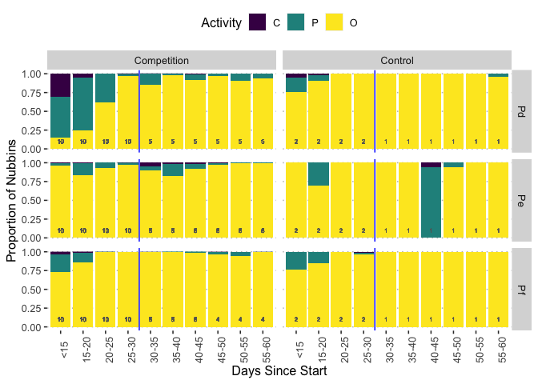

Polyp Activity. Plots and Final Statistics
================
Rhondda Jones, Natalia Andrade and Ira Cooke
29/08/2017

``` r
polyp_act<-read_csv("raw_data/Porites_polypact.csv") %>% 
  mutate_if(is.numeric, as.factor) 


polyp_act_long <- polyp_act %>% 
  pivot_longer(cols = starts_with("DAY"), names_to="Time", values_to="Activity") %>% 
  mutate(Time=as.integer(str_match(Time, pattern = "DAY([0-9]+)")[,2])) %>% 
  mutate(Activity=factor(Activity, levels = c("C", "P","O"), ordered=TRUE)) %>% 
  mutate(TANK=as.factor(TANK)) %>% 
  mutate(TimeCat = cut(Time, breaks=c(0,14.1,19.1,24.1,29.1,34.1,39.1,44.1,49.1,54.1,60))) %>% 
  mutate(TimeCat = factor(TimeCat,
         labels=c("<15","15-20","20-25","25-30","30-35","35-40","40-45","45-50","50-55","55-60")))
```

This is a ggplot equivalent of of the Mosaicplots used in data
exploration. This shows data aggregated across nubbins and tanks which
does hide some important variation that is hard to capture graphically
(see stats). Overall however there are two clear trends;

1.  The treated colonies are more likely to be partial or closed than
    controls
2.  Colonies seemed to be more likely to be partial or closed at the
    start of the trial and gradually converted to open as the trial
    progressed.

## TODO

  - Make plot more presentable for the paper
  - Find a way to display differences between groups of nubbins based on
    their interacting Lobophytum partner that mirrors trends seen in the
    DESeq analysis

<!-- end list -->

``` r
polyp_act_long %>% na.omit() %>% 
  ggplot(aes(x=TimeCat)) + 
  geom_bar(aes(fill=Activity), position = "fill") +
  facet_grid(HARD~TREAT) + 
  theme(axis.text.x = element_text(angle=90)) + 
  xlab("Time Category") + ylab("")
```

<!-- -->
