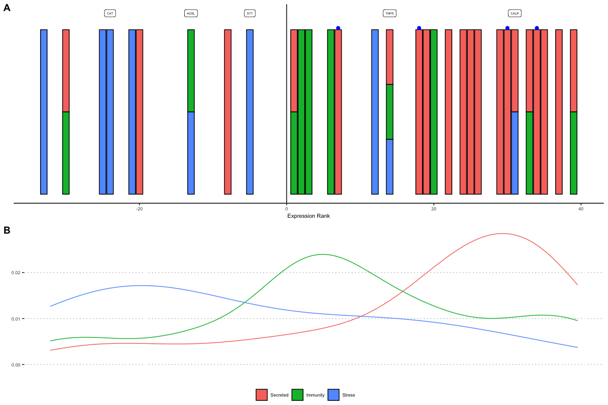

Gene function analysis
================
Natalia Andrade and Ira Cooke
07/08/2017

Gene function analysis is based on the following datasets; - Functional
annotations created in `01_annotate` for all clusters - Differential
expression analysis (from `02_deseq.Rmd`) to select genes DE between
control and treatment - Manual annotations created by curating automatic
annotations along with literature searches for DE genes - K-means
clustering groups which identify genes (Corset clusters) identified in
the heatmap (see `04_polyp_activity.Rmd`)

Our focus initially is on the genes differentially expressed between
control and treatment. Raw (normalised) counts for a handful of the top
genes are plotted here as a sanity check to ensure that they look
genuinely differentially expressed.

<!-- -->

Next we plot the relative expression for genes in key categories,
Immunity, Stress and Secreted (Toxins). We use ranks in this plot
because some of these genes have extreme outlying fold change values
(due to being abundant in a few samples and absent in others) and would
distort a more conventional plot such as a volcanoplot.

<!-- -->

Figure 3: Ranking distribution of differentially expressed transcripts
under non-contact competition by functional category: “Stress” in blue,
“Immunity” in green and “Secreted” in red. Individual transcripts are
shown as vertical bars positioned along the horizontal axis (points)
according to the rank of their effect size (log2 fold change under
competition compared with controls). Positive ranks represent
transcripts up-regulated in competition compared to controls.
Transcripts belonging to multiple categories are shown as multi-coloured
bars. The density of genes in each category are shown as smoothed lines
above the bar plot. Blue points represent putative toxins. Category
“Stress” includes transcripts associated with response to reactive
oxygen species as well as those involved in the unfolded protein
response. Labelled points correspond to transcripts with strong evidence
of homology to named proteins (CAT: calase, AOSL: allene oxide
synthase-lipoxygenase, SYT: synaptotagmin-like, TNFR: tumor necrosis
factor receptor, CALR: calreticulin).
