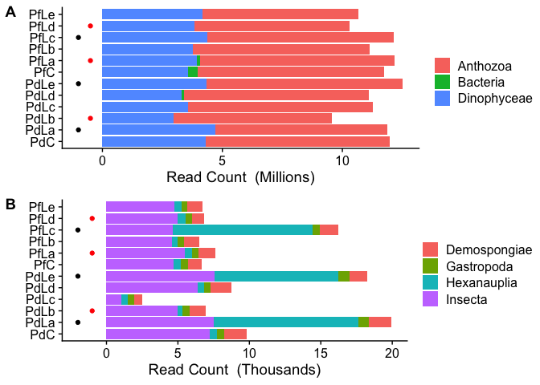
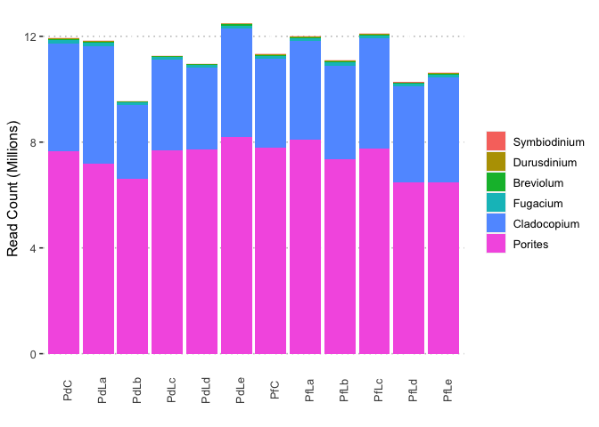

Kraken analysis
================

To identify potential sources of contamination we profiles the taxonomic
composition of raw RNA-seq reads using Kraken. Although Kraken can
perform very rapid classification of reads it relies on a pre-built
database based on available genomic sequences. These databases are
available for download for bacterial and viral sequences but need to be
built separately for Eukaryotes. Unfortunately it was not possible to
include a large number of Eukaryotic genomes in this process due to the
huge computational resources required. We therefore built a custom
database for approximate classification of reads including the
following;

  - Kraken standard bacteria
  - *Porites lutea* (Coral) genome
  - *Drosophila melanogaster* (Fruit fly) genome
  - *Lottia gigantea* (Gastropod) genome
  - *Amphimedon queenslandica* (Sponge) genome
  - *Acropora digitifera* (Coral) genome
  - *Amphibalanus amphitrite* (Barnacle) genome
  - *Cladocopium* (Clade C - Algal Symbiont) genome
  - *Breviolum* (Clade B - Algal Symbiont) genome
  - *Durusdinium* (Clade D - Algal Symbiont) genome
  - *Fugacium* (Clade F - Algal Symbiont) genome
  - *Symbiodinium* (Clade A - Algal Symbiont) genome

Kraken 1 was used to build a database with kmer size 31 using these
genomic resources. Then raw RNA sequencing reads from each sample were
classified and used to generate summaries of the LCA for each read in
mpa format.

The figure below summarises the LCA of reads. Key samples are shown with
dots to the left of bars, with black dots indicating samples with known
barnacle contamination and red dots show samples in group 4 (See main
manuscript Figure 2).

Since Coral and Symbiodiniaceae reads are so dominant the lower level
contaminants are not visible in the top plot. Three samples in the top
plot (PfC, PdLd and PfLa) show some contamination with bacteria but this
is still a relatively minor component of the overall read volume.

The lower plot shows reads after excluding these dominant taxa. This
clearly reveals the three Barnacle containing samples as having a large
number of reads with LCA as Hexanauplia (Barnacles). The remaining
samples all showed a small number of Gastropod and Sponge assigned reads
as well as several thousand classified under Insecta. Since the numbers
of reads involved here are quite low this probably reflects some
misclassification due to the highly incomplete nature of our kraken
database. Importantly, the key samples in group 4 show LCA profiles that
were very similar to the other samples. This suggests that DEG patterns
in those samples are unlikely to have arisen due to a contaminant in
those samples.

<!-- -->

Finally we examined the breakdown of Symbiont reads into components for
the different Symbiodiniaceae genera. This revealed that the dominant
algal symbiont in this case was Cladocopium.

<!-- -->
