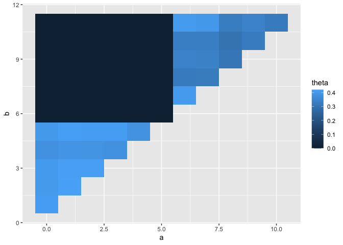

Genotyping
================

To check that the two colonies of Porites used this study were indeed
distinct genotypes we performed genotyping and relatedness analysis on
all samples.

First we removed clusters with multiple transcripts because these are
indicative of potential alternative splicing or multiple gene copies and
are more likely to produce incorrect read mappings and genotypes.

In addition we removed clusters that were not expressed with at least a
count of 3 in all 12 samples.

After applying these filtering steps a list of 17093 good transcripts
for genotyping were obtained.

This was then used to create a bed file and read alignments overlapping
this bed file were extracted for input to angsd. We then ran angsd to
call SNPs and calculte genotype likelihoods.Analysis with angsd resulted
in a total of 30289 SNPs. These were then used for analysis with
ngsRelate. Relevant commands are in;

  - [01\_prepare\_inputs.sh](hpc/genotypes/01_prepare_inputs.sh)
  - [02\_angsd.sh](hpc/genotypes/02_angsd.sh)
  - [03\_ngsrelate.sh](hpc/genotypes/03_ngsrelate.sh)

Although ngsRelate calculates many statistics the key statistic for our
purposes is the relatedness statistic, theta. For a diploid organism
this statistic has a value of 0.5 for clones and should approach 0 for
unrelated individuals. In the figure below we show this value for all
pairs of samples where samples numbered 0-5 are Pd and those numbered
6-11 are Pf. It confirms our assumption that fragments from the same
colony are clones (light blue) and fragments from different colonies
have distinct (unrelated) genotypes.

<!-- -->
